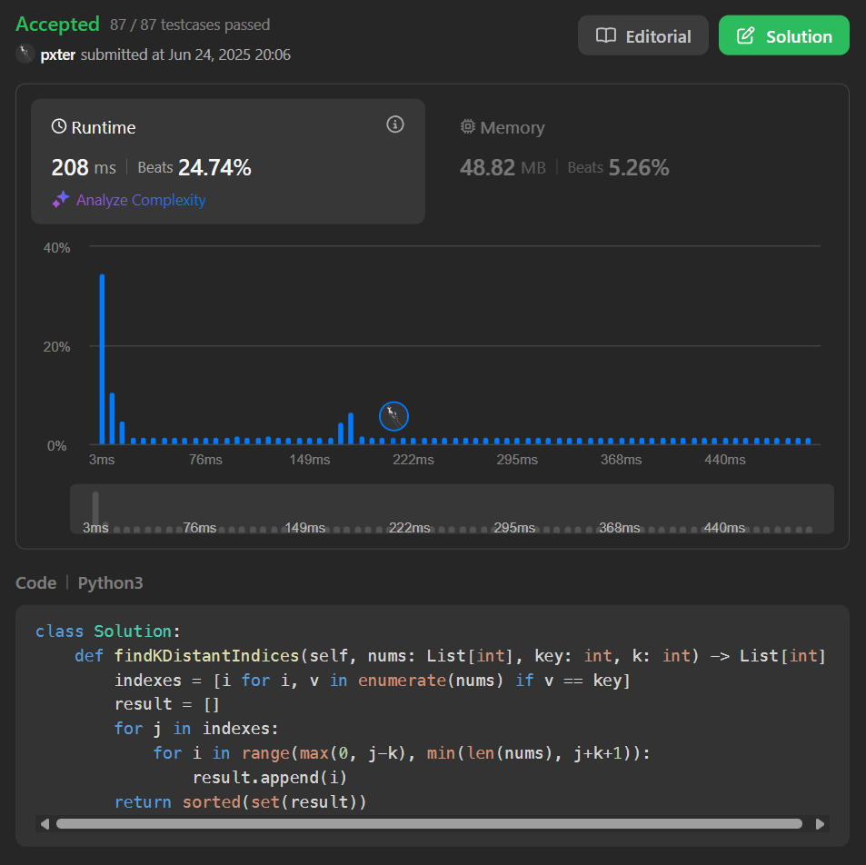

[Link](https://leetcode.com/problems/find-all-k-distant-indices-in-an-array/description/)

```python
class Solution:
    def findKDistantIndices(self, nums: List[int], key: int, k: int) -> List[int]:
        indexes = [i for i, v in enumerate(nums) if v == key]
        result = []
        for j in indexes:
            for i in range(max(0, j-k), min(len(nums), j+k+1)):
                result.append(i)
        return sorted(set(result))
```

Could be made faster:

